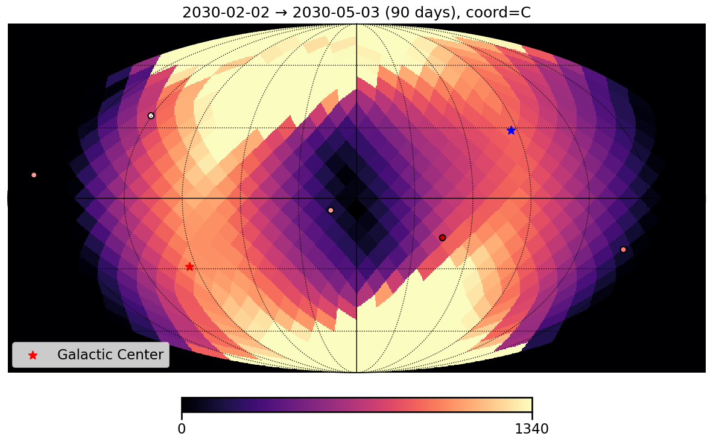

# Jasmine_orbit

`Jasmine_orbit` is a tool for checking the visibility of a target and estimating thermal input conditions.

This project is largely based on RPR-SJ4B0509 (by H. Kataza).

For attitude during non-observation periods, RPR-SJ512017B was referenced, and the corresponding logic in OrbitAttitude.py was modified accordingly.

For more details, please refer to the document ``JASMINE-C2-TN-YKS-20251217-01-thermal_input'' on the JASMINE Wiki (accessible to JASMINE team members only).

## 📦 Installation

### Requirements
- Python 3.9 or later

### Install from GitHub

You can install the package directly from GitHub using `pip`:

```bash
pip install git+https://github.com/YuiKasagi/jasmine_orbit.git
```
Alternatively, clone the repository and install it locally:
```bash
git clone https://github.com/YuiKasagi/jasmine_orbit.git
cd jasmine_orbit
pip install .
```

## 🌱 Usage

### 🔧 Configuration

This package ships with **built-in default parameters**.  
All default values (thresholds, angle limits, etc.) are defined in:

- `src/jasmine_orbit/defaults.py`

You **do not need to edit** files under `src/` for normal use.

#### User configuration (recommended)

If you want to customize parameters (e.g., output directories, thresholds, catalog paths), create your own configuration file in your working directory (or anywhere you like), for example:

- `config/example_settings.py`

Then pass your config to functions/classes that support it:

```python
from config.example_settings import CONFIG
from jasmine_orbit.OrbitAttitude import calc_attitude

result = calc_attitude(..., config=CONFIG)
```
This approach keeps the library code immutable while allowing each user/project to manage settings in a reproducible way.

### ⭐️ Estimating Thermal Input to the Radiator Panel

#### Example

The following command performs a calculation for GJ 3929, starting 45 days after the vernal equinox, running for 90 days, and outputs both figures and data:

```
python main_target.py -s -p 45.0 -w 90. -o -t "GJ 3929" 
```

The output figure looks like the following:


The horizontal axis shows the orbit number (with dates on the top axis), and the vertical axis shows the heat input metric integrated over one orbit.

#### Command-line Options

```
usage:
    main_target.py [-h|--help] (-s|-a) -p <day_offset> -w <days> [-o] [-t <target_name>] [-m <minutes>]

options:
    -h --help           show this help message and exit
    -s                  use the vernal equinox as the reference date
    -a                  use the autumnal equinox as the reference date
    -p <day_offset>     calculation start day offset from the reference date (inclusive)
    -w <days>           calculation duration in days
    -o                  enable graph output (True or False)
    -t <target_name>    target name
    -m <minutes>        time step in minutes [default: 1]
```

### 👀 Visibility Map

#### Example

The following command performs a calculation starting 45 days *before* the vernal equinox, running for 90 days, with a time step of 2 minutes, and outputs the resulting figures:

```
python main_target.py -s -p -45.0 -w 90. -m 2 -o 
```

Please note that this calculation requires significant CPU resources and may take a long time (>30min.) to complete.
You can reduce the computational cost by adjusting the time step and/or the HEALPix resolution (nside, default: 8).

The output figure looks like the following:



In this map, a region is defined as “visible” when it is observable and the thermal input to the radiator during a single orbit is small.
The color map indicates the number of orbits for which each region is visible.
The figure is shown in equatorial coordinates.
The marked star positions correspond to the Galactic center and its counterpart (the opposite direction).
Darker regions indicate areas with fewer visible orbits, while brighter regions represent areas that are visible throughout all seasons.

## License
This project is released under the MIT License.
See the LICENSE file for full license text.